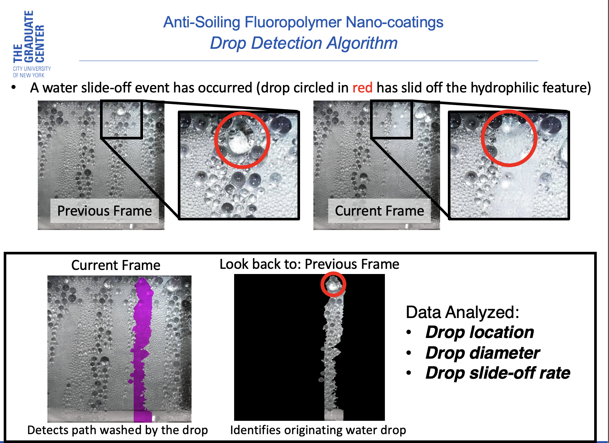
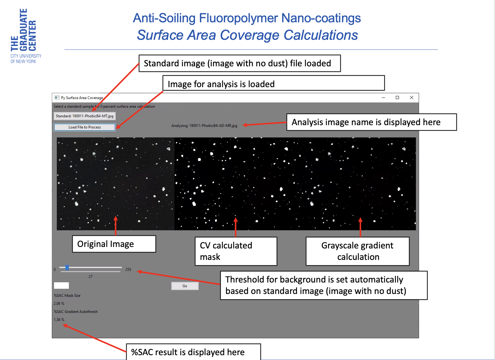

<!-- header is made with: https://github.com/kyechan99/capsule-render -->

---

## Overview
PyCondrop is a set of computer vision utilities for photovoltaic (PV) glass soiling analysis,
for evaluation of anti-soiling and self-cleaning surface coatings.
The programs included in the software package allow the user to:

---

### PyDrop



This program analyzes dew formation on the PV glass in laboratory and field conditions.

- Determines the dew drop size and location.
- Helps user to calculate dew drop slide off times.
- Automatically calculates and maps the area and location of parts of glass cleaned by sliding dewdrops using OpenCV methods.
- Provides smart detection of dew water drops on the surface of the PV glass.
- Motion detaction and drop path calculation.

---

### PySurfaceArea



Provides tools for quantification of dust deposition on the surface of PV glass.

- Calculates % Surface Area Coverage (%SAC) of dust on the surface of the solar glass
- Using light refleaction intensity methods to take into account thickness of the dust coating on glass.

---

## Requirements

Python 3.6 is required to run the application.<br />
[Anaconda Python](https://conda.io/projects/conda/en/latest/user-guide/install/index.html?highlight=conda) environment is advised. <br />
Please use [pip](https://pip.pypa.io/en/stable/) to install the following dependancies:

```python
pip install opencv-python
pip install scikit-image, scikit-learn, scipy, scimage
pip install numpy, pandas
pip install matplotlib
pip install imutils, pathlib, pytest-shutil
pip install -U wxPython
pip install tqdm
```
---

## Troubleshooting

Any trouble encountered with the software should be reported to:<br>
Illya Nayshevsky, Ph.D.<br>
illya.nayshevsky@gmail.com

---

## Authors and acknowledgment
[Illya Nayshevsky, Ph.D.](http://www.illya.bio) [](https://www.linkedin.com/in/illyanayshevskyy/)<br>
College of Staten Island<br />
Chemistry Department<br />
2800 Victory Blvd, Building 6S<br />
Staten Island, NY 10314<br />
[CSI CUNY Homepage](https://www.csi.cuny.edu/academics-and-research/departments-programs/chemistry)

## License
[MIT](https://choosealicense.com/licenses/mit/)
